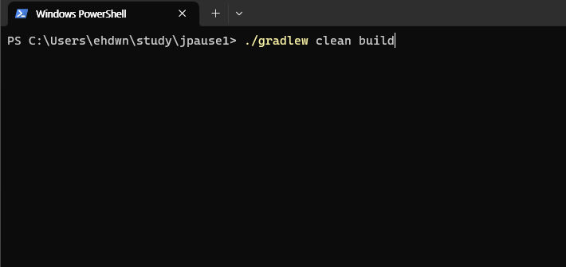
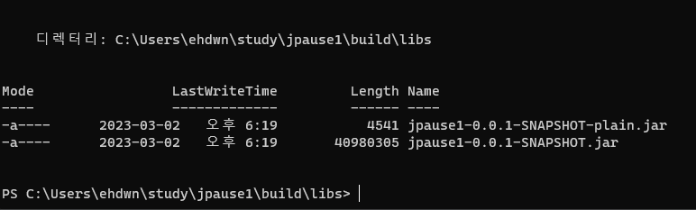
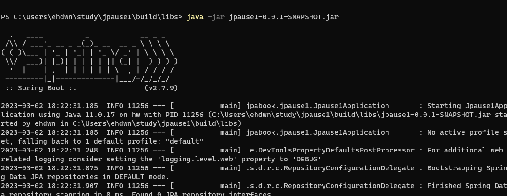
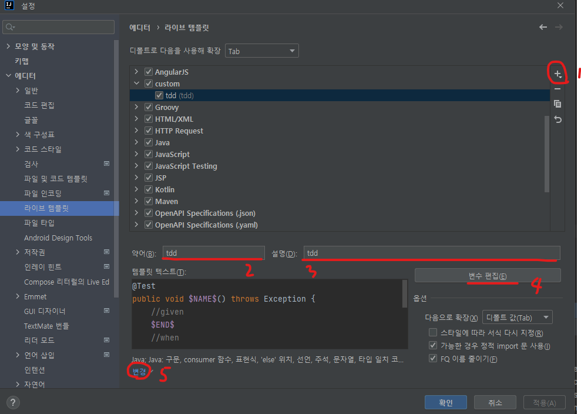
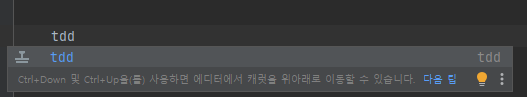
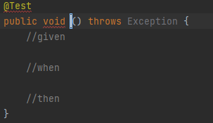
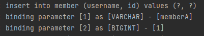
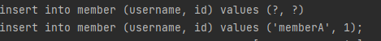

# 프로젝트 환경설정

**목차**

---

- 프로젝트 생성
- 라이브러리 살펴보기
- View 환경설정
- H2 데이터베이스 설치
- JPA와 DB 설정, 동작확인

## 프로젝트 생성

- 스프링 부트 스타터 [(https://start.spring.io/)](https://start.spring.io)
- Project: **Gradle** - **Groovy** Project
- 사용 가능: web, thymeleaf, jpa, h2, lombok
    - groupId: jpabook
    - artifactId: jpause1

**롬복 적용**

---

1. Preferences → plugin → lombok 검색 실행(재시작)
2. Preferences → Annotation Processors 검색 → Enable annotation processing 체크 (재시작)

## 라이브러리 살펴보기

**gradle 의존관계 보기**

---

`./gradlew dependencies --configuration compileClasspath`

**스프링 부트 라이브러리 살펴보기**

---

- spring-boot-starter-web
    - spring-boot-starter-tomcat: 톰캣(웹 서버)
    - spring-webmvc: 스프링 웹 MVC
- spring-boot-starter-thymeleaf: 타임리프 템플릿 엔진(View)
- spring-boot-starter-data-jpa
    - spring-boot-starter-aop
    - spring-boot-starter-jdbc
        - HikariCP 커넥션 풀(부트 2.0 기본)
    - hibernate + JPA: 하이버네이트 + JPA
    - spring-data-jpa:스프링 데이터 JPA
- spring-boot-starter(공통): 스프링 부트 + 스프링 코어 + 로깅
    - spring-boot
        - spring-core
    - spring-boot-starter-loggin
        - logback, slf4j

**테스트 라이브러리**

---

- spring-boot-starter-test
    - junit: 테스트 프레임워크
    - mockito: 목 라이브러리
    - assertj: 테스트 코드를 좀 더 편하게 작성하게 도와주는 라이브러리
    - spring-test: 스프링 통합 테스트 지원

**핵심 라이브러리**

---

- 스프링 MVC
- 스프링 ORM
- JPA, 하이버네이트
- 스프링 데이터 JPA

**기타 라이브러리**

---

- H2 데이터베이스 클라이언트
- 커넥션 풀: 부트 기본은 HikariCP
- WEB(thymeleaf)
- 로깅 SLF4J & LogBack
- 테스트

> 참고:
스프링 데이터 JPA는 스프링과 JPA를 먼저 이해하고 사용해야 하는 응용기술이다.
>

## View 환경 설정

**thymeleaf 템플릿 엔진**

---

- thymeleaf 공식 사이트: [https://www.thymeleaf.org/](https://www.thymeleaf.org/)
- 스프링 공식 튜토리얼: [https://spring.io/guides/gs/serving-web-content/](https://spring.io/guides/gs/serving-web-content/)
- 스프링부트 메뉴얼:  [https://docs.spring.io/spring-boot/docs/2.1.6.RELEASE/reference/html/ boot-features-developing-web-applications.html#boot-features-spring-mvc-templateengines](https://docs.spring.io/spring-boot/docs/2.1.6.RELEASE/reference/html/)

- 스프링 부트 thymeleaf viewName 매핑
    - `resources:template/` + {ViewName} + `.html`

**템플릿 엔진 동작 확인**

---

*HelloController*

```java
@Controller
public class HelloController {

    @GetMapping("hello")
    public String hello(Model model) {
        model.addAttribute("data", "hello!!!");
        return "hello";
    }
}
```

*hello.html*

```html
<!DOCTYPE HTML>
<html xmlns:th="http://www.thymeleaf.org">
<head>
  <title>Hello</title>
  <meta http-equiv="Content-Type" content="text/html; charset=UTF-8" />
</head>
<body>
<p th:text="'안녕하세요. ' + ${data}" >안녕하세요. 손님</p>
</body>
</html>
```

- 위치: `resources/templates/hello.html`

*index.html (welcome page)*

```html
<!DOCTYPE HTML>
<html xmlns:th="http://www.thymeleaf.org">
<head> 
  <title>Hello</title>
  <meta http-equiv="Content-Type" content="text/html; charset=UTF-8" />
</head>
<body>
Hello
<a href="/hello">hello</a>
</body>
</html>
```

> 참고:
`spring-boot-devtools`라이브러리를 추가하면, `html`파일을 컴파일만 해주면 서버 재시작없이 View 파일 변경이 가능하다.
**※ 인텔리J 컴파일 방법: 메뉴 build → Recompile**
>

## H2 데이터베이스 설치

- 개발이나 테스트 용도로 가볍고 편리한 DB, 웹 화면 제공
- [https://www.h2database.com](https://www.h2database.com)
- 다운로드 및 설치
- 데이터베이스 파일 생성 방법
  - `jdbc:h2:~/jpashop` (최소 한번)
  - `~/jpashop.mv.db`파일 생성 확인
  - 이후 부터는 `jdbc:h2:tcp://localhost/~/jpashop`이렇게 접속

> 주의: H2 데이터베이스의 MVCC 옵션은 H2 1.4.198 버전부터 제거되었습니다.
>

## JPA와 DB 설정, 동작 확인

*application.yml*

```yaml
spring:
  datasource:
    url: jdbc:h2:tcp://localhost/~/jpashop
    username: sa
    password:
    driver-class-name: org.h2.Driver

  jpa:
    hibernate:
      ddl-auto: create
      properties:
        hibernate:
#          show_sql: true
          format_sql: true

logging.level:
  org.hibernate.SQL: debug
```

- `spring.jpa.hibernate.ddl-auto: create`
  - 이 옵션은 애플리케이션 실행 시점에 테이블을 drop하고, 다시 생성한다.

> 참고: 모든 로그 출력은 가급적 조거를 통해 남겨야 한다.
`show_sql`: 옵션은 `System.out`에 하이버네이트 실행 SQL을 남긴다.
`org.hibernate.SQL`: 옵션은 logger를 통해 하이버네이트 실행 SQL을 남긴다.
>

> 주의: `application.yml`같은 `yml`파일은 띄어쓰기(스페이스) 2칸으로 계층을 만듭니다. 따라서 띄어쓰기 2칸을 필수로 적어주어야 합니다.
예를 들어서 아래의 `datasource`는 `spring:` 하위에 있고 앞에 띄어쓰기 2칸이 있으므로 `spring.datasource`가 됩니다. 다음 코드에 주석으로 띄어쓰기를 적어두었습니다.
>

**yml 띄어쓰기 주의**

```yaml
spring:  #띄어쓰기 없음
  datasource:  #띄어쓰기 2칸
    url: jdbc:h2:tcp://localhost/~/jpashop  #4칸
    username: sa
    password:
    driver-class-name: org.h2.Driver

  jpa:  #띄어쓰기 2칸
    hibernate:  #띄어쓰기 4칸
      ddl-auto: create  #띄어쓰기 6칸
      properties:  #띄어쓰기 4칸
        hibernate:  #띄어쓰기 6칸
#          show_sql: true  #띄어쓰기 8칸
          format_sql: true  #띄어쓰기 8칸

logging.level:  #띄어쓰기 없음
  org.hibernate.SQL: debug  #띄어쓰기 2칸
```

**실제 동작하는지 확인하기**

---

*Member*

```java
@Entity
@Getter @Setter
public class Member {

    @Id @GeneratedValue
    private Long id;
    private String username;
}
```

*MemberRepository*

```java
@Repository
public class MemberRepository {

    @PersistenceContext
    private EntityManager em;

    public Long save(Member member) {
        em.persist(member);
        return member.getId();
    }

    public Member find(Long id) {
        return em.find(Member.class, id);
    }

}
```

*MemberRepositoryTest*

```java
@RunWith(SpringRunner.class)
@SpringBootTest
public class MemberRepositoryTest {

    @Autowired
    MemberRepository memberRepository;

    @Test
    @Transactional
    @Rollback(false)
    public void testMember() throws Exception {
        //given
        Member member = new Member();
        member.setUsername("memberA");

        //when
        Long saveId = memberRepository.save(member);
        Member findMember = memberRepository.find(saveId);

        //then
        Assertions.assertThat(findMember.getId()).isEqualTo(member.getId());
        Assertions.assertThat(findMember.getUsername()).isEqualTo(member.getUsername());
        Assertions.assertThat(findMember).isEqualTo(member);
    }
}
```

> 주의! `@Test`는 JUnit4를 사용하면 org.junit.Test를 사용하셔야 합니다. 만약 JUnit5 버전을 사용하면 그것에 맞게 사용하시면 됩니다.
>
- Entity, Repository 동작 확인
- jar 빌드해서 동작 확인



프로젝트 경로에서 `./gradlew clean build` 커맨드 입력시 `${프로젝트 경로}/build/libs`안에 프로젝트의 jar파일이 생성됩니다.



해당 경로에서 `java -jar jpause1-0.0.1-SNAPSHOT.jar` 커맨드 입력시 서버가 실행됩니다.



> 오류: 테스트를 실행했는데 다음과 같이 테스트를 찾을 수 없는 오류가 발생하는 경우
`No tests found for given includes: [jpabook.jpashop.MemberRepositoryTest]
(filter.includeTestsMatching)`
해결: 스프링 부트 2.1.x 버전을 사용하지 않고, 2.2.x 이상 버전을 사용하면 JUnit5가 설치된다. 이때는 `build.gradle`마지막에 다음 내용을 추가하면 테스트를 인식할 수 있다. JUnit5 부터는 `build.gradle`에 다음 내용을 추가해야 테스트가 인식된다.
>

`build.gradle`마지막에 추가

```
test {
  useJUnitPlatform()
}
```

> 참고: 스프링 부트를 통해 복잡한 설정이 다 자동화 되었다. `persistence.xml`도 없고, `LocalContainerEntityManagerFactoryBean`도 없다. 스프링 부트를 통한 추가 설정은 스프링 부트 메뉴얼을 참고하고, 스프링 부트를 사용하지 않고 순수 스프링과 JPA 설정 방법은 자바 ORM 표준 JPA 프로그래밍 책을 참고하자.
>

**라이브 템플릿 사용해서 편하게 소스 작성하기**

---

`파일 → 설정 → 에디터 → 라이브 템플릿` 을 클릭하면 아래와 같은 이미지가 나오는데



1. `+`버튼을 클릭해서 템플릿을 만듭니다.
2. 사용할 커맨드 약자를 입력합니다.
3. 해당 템플릿의 설명을 명시해줍니다.
4. `$NAME$`같은 변수가 있을 경우 변수를 편집할 수 있습니다.
5. `변경` 버튼을 클릭해서 해당 템플릿을 어디서 사용할지 선택해줍니다.

*사용*



- 커맨드 약자를 입력하면 위와 같이 템플릿을 추천해주고 enter키를 입력시



- 위와 같이 입력한 템플릿이 자동으로 입력됩니다.

**쿼리 파라미터 로그 남기기**

---

- 로그에 다음을 추가하기: SQL 실행 파라미터를 로그로 남긴다.
- **주의! 스프링 부트 3.x를 사용한다면 영상 내용과 다르기 때문에 다음 내용을 참고하자.**
  - 스프링 부트 2.x, hibernate5
    - `org.hibernate.type: trace`
  - 스프링 부트 3.x, hibernate6
    - `org.hibernate.orm.jdbc.bind: trace`

  *실행*

  

  - 위와 같이 파라미터가 어떤건지 표시해준다.
- 외부 라이브러리 사용
  - [https://github.com/gavlyukovskiy/spring-boot-data-source-decorator](https://github.com/gavlyukovskiy/spring-boot-data-source-decorator)

  스프링 부트를 사용하면 이 라이브러리만 추가하면 된다.

    ```
    implementation 'com.github.gavlyukovskiy:p6spy-spring-boot-starter:1.5.6'
    ```

  *실행*

  

  - 실제 파라미터가 들어간 쿼리를 표시해준다.

> 참고: 쿼리 파라미터를 로그로 남기는 외부 라이브러리는 시스템 자원을 사용하므로, 개발 단계에서는 편하게 사용해도 된다. 하지만 운영시스템에 적용하려면 꼭 성능 테스트를 하고 사용하는 것이 좋다.
>