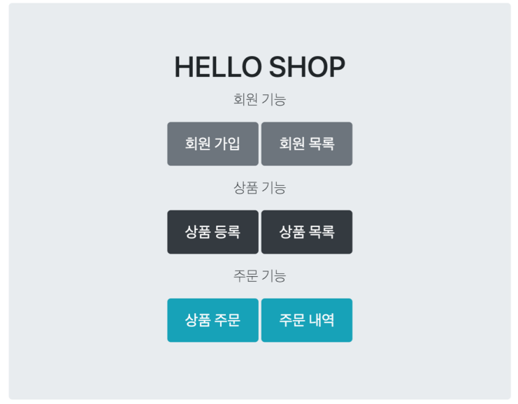
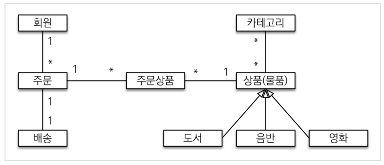
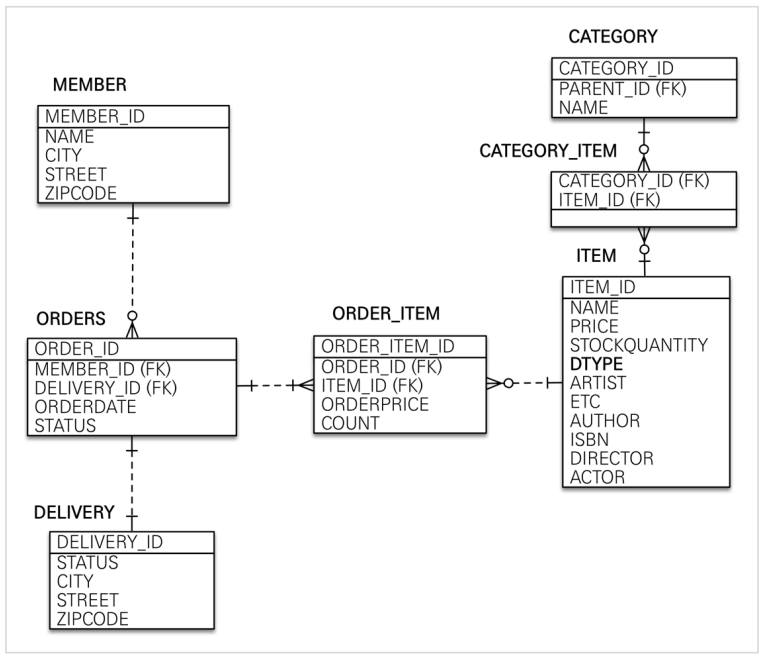
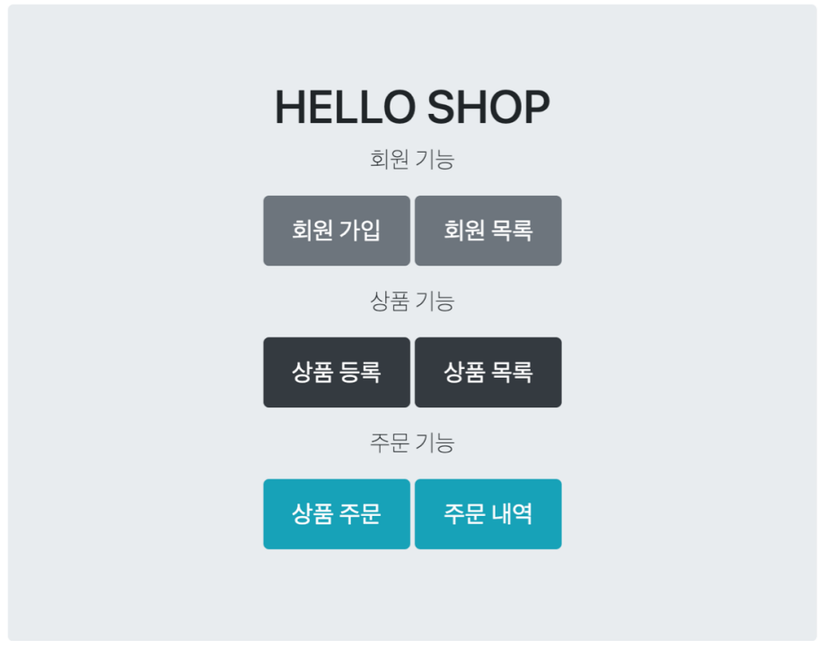
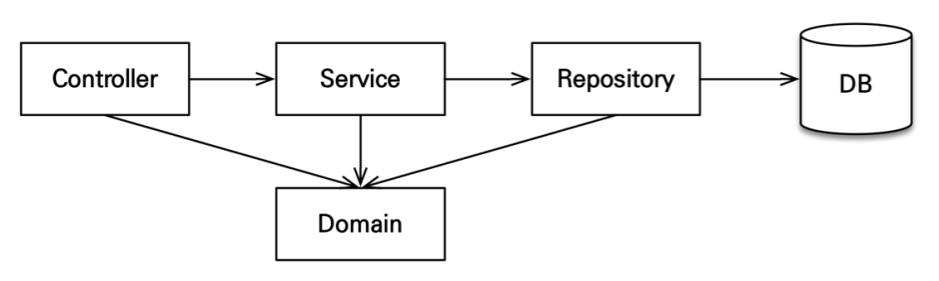
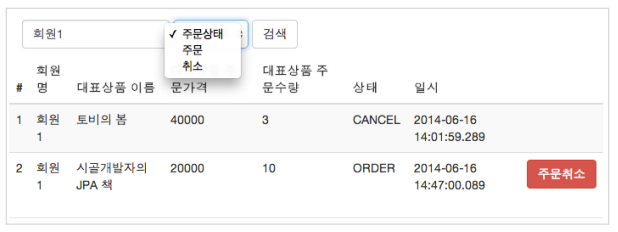
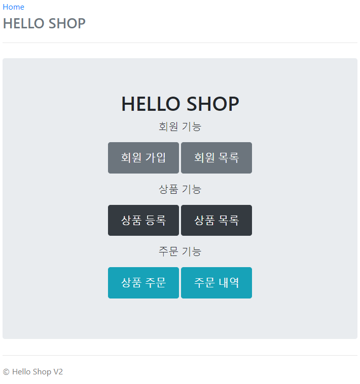
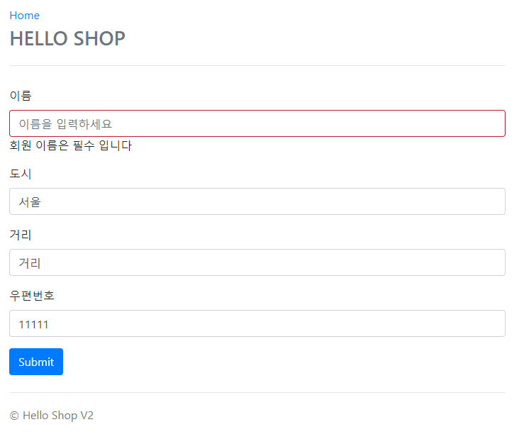

# 프로젝트 환경설정

**목차**

---

- 프로젝트 생성
- 라이브러리 살펴보기
- View 환경설정
- H2 데이터베이스 설치
- JPA와 DB 설정, 동작확인

## 프로젝트 생성

- 스프링 부트 스타터 [(https://start.spring.io/)](https://start.spring.io)
- Project: **Gradle** - **Groovy** Project
- 사용 가능: web, thymeleaf, jpa, h2, lombok
    - groupId: jpabook
    - artifactId: jpause1

**롬복 적용**

---

1. Preferences → plugin → lombok 검색 실행(재시작)
2. Preferences → Annotation Processors 검색 → Enable annotation processing 체크 (재시작)

## 라이브러리 살펴보기

**gradle 의존관계 보기**

---

`./gradlew dependencies --configuration compileClasspath`

**스프링 부트 라이브러리 살펴보기**

---

- spring-boot-starter-web
    - spring-boot-starter-tomcat: 톰캣(웹 서버)
    - spring-webmvc: 스프링 웹 MVC
- spring-boot-starter-thymeleaf: 타임리프 템플릿 엔진(View)
- spring-boot-starter-data-jpa
    - spring-boot-starter-aop
    - spring-boot-starter-jdbc
        - HikariCP 커넥션 풀(부트 2.0 기본)
    - hibernate + JPA: 하이버네이트 + JPA
    - spring-data-jpa:스프링 데이터 JPA
- spring-boot-starter(공통): 스프링 부트 + 스프링 코어 + 로깅
    - spring-boot
        - spring-core
    - spring-boot-starter-loggin
        - logback, slf4j

**테스트 라이브러리**

---

- spring-boot-starter-test
    - junit: 테스트 프레임워크
    - mockito: 목 라이브러리
    - assertj: 테스트 코드를 좀 더 편하게 작성하게 도와주는 라이브러리
    - spring-test: 스프링 통합 테스트 지원

**핵심 라이브러리**

---

- 스프링 MVC
- 스프링 ORM
- JPA, 하이버네이트
- 스프링 데이터 JPA

**기타 라이브러리**

---

- H2 데이터베이스 클라이언트
- 커넥션 풀: 부트 기본은 HikariCP
- WEB(thymeleaf)
- 로깅 SLF4J & LogBack
- 테스트

> 참고:
스프링 데이터 JPA는 스프링과 JPA를 먼저 이해하고 사용해야 하는 응용기술이다.
>

## View 환경 설정

**thymeleaf 템플릿 엔진**

---

- thymeleaf 공식 사이트: [https://www.thymeleaf.org/](https://www.thymeleaf.org/)
- 스프링 공식 튜토리얼: [https://spring.io/guides/gs/serving-web-content/](https://spring.io/guides/gs/serving-web-content/)
- 스프링부트 메뉴얼:  [https://docs.spring.io/spring-boot/docs/2.1.6.RELEASE/reference/html/ boot-features-developing-web-applications.html#boot-features-spring-mvc-templateengines](https://docs.spring.io/spring-boot/docs/2.1.6.RELEASE/reference/html/)

- 스프링 부트 thymeleaf viewName 매핑
    - `resources:template/` + {ViewName} + `.html`

**템플릿 엔진 동작 확인**

---

*HelloController*

```java
@Controller
public class HelloController {

    @GetMapping("hello")
    public String hello(Model model) {
        model.addAttribute("data", "hello!!!");
        return "hello";
    }
}
```

*hello.html*

```html
<!DOCTYPE HTML>
<html xmlns:th="http://www.thymeleaf.org">
<head>
  <title>Hello</title>
  <meta http-equiv="Content-Type" content="text/html; charset=UTF-8" />
</head>
<body>
<p th:text="'안녕하세요. ' + ${data}" >안녕하세요. 손님</p>
</body>
</html>
```

- 위치: `resources/templates/hello.html`

*index.html (welcome page)*

```html
<!DOCTYPE HTML>
<html xmlns:th="http://www.thymeleaf.org">
<head> 
  <title>Hello</title>
  <meta http-equiv="Content-Type" content="text/html; charset=UTF-8" />
</head>
<body>
Hello
<a href="/hello">hello</a>
</body>
</html>
```

> 참고:
`spring-boot-devtools`라이브러리를 추가하면, `html`파일을 컴파일만 해주면 서버 재시작없이 View 파일 변경이 가능하다.
**※ 인텔리J 컴파일 방법: 메뉴 build → Recompile**
>

## H2 데이터베이스 설치

- 개발이나 테스트 용도로 가볍고 편리한 DB, 웹 화면 제공
- [https://www.h2database.com](https://www.h2database.com)
- 다운로드 및 설치
- 데이터베이스 파일 생성 방법
  - `jdbc:h2:~/jpashop` (최소 한번)
  - `~/jpashop.mv.db`파일 생성 확인
  - 이후 부터는 `jdbc:h2:tcp://localhost/~/jpashop`이렇게 접속

> 주의: H2 데이터베이스의 MVCC 옵션은 H2 1.4.198 버전부터 제거되었습니다.
>

## JPA와 DB 설정, 동작 확인

*application.yml*

```yaml
spring:
  datasource:
    url: jdbc:h2:tcp://localhost/~/jpashop
    username: sa
    password:
    driver-class-name: org.h2.Driver

  jpa:
    hibernate:
      ddl-auto: create
      properties:
        hibernate:
#          show_sql: true
          format_sql: true

logging.level:
  org.hibernate.SQL: debug
```

- `spring.jpa.hibernate.ddl-auto: create`
  - 이 옵션은 애플리케이션 실행 시점에 테이블을 drop하고, 다시 생성한다.

> 참고: 모든 로그 출력은 가급적 조거를 통해 남겨야 한다.
`show_sql`: 옵션은 `System.out`에 하이버네이트 실행 SQL을 남긴다.
`org.hibernate.SQL`: 옵션은 logger를 통해 하이버네이트 실행 SQL을 남긴다.
>

> 주의: `application.yml`같은 `yml`파일은 띄어쓰기(스페이스) 2칸으로 계층을 만듭니다. 따라서 띄어쓰기 2칸을 필수로 적어주어야 합니다.
예를 들어서 아래의 `datasource`는 `spring:` 하위에 있고 앞에 띄어쓰기 2칸이 있으므로 `spring.datasource`가 됩니다. 다음 코드에 주석으로 띄어쓰기를 적어두었습니다.
>

**yml 띄어쓰기 주의**

```yaml
spring:  #띄어쓰기 없음
  datasource:  #띄어쓰기 2칸
    url: jdbc:h2:tcp://localhost/~/jpashop  #4칸
    username: sa
    password:
    driver-class-name: org.h2.Driver

  jpa:  #띄어쓰기 2칸
    hibernate:  #띄어쓰기 4칸
      ddl-auto: create  #띄어쓰기 6칸
      properties:  #띄어쓰기 4칸
        hibernate:  #띄어쓰기 6칸
#          show_sql: true  #띄어쓰기 8칸
          format_sql: true  #띄어쓰기 8칸

logging.level:  #띄어쓰기 없음
  org.hibernate.SQL: debug  #띄어쓰기 2칸
```

**실제 동작하는지 확인하기**

---

*Member*

```java
@Entity
@Getter @Setter
public class Member {

    @Id @GeneratedValue
    private Long id;
    private String username;
}
```

*MemberRepository*

```java
@Repository
public class MemberRepository {

    @PersistenceContext
    private EntityManager em;

    public Long save(Member member) {
        em.persist(member);
        return member.getId();
    }

    public Member find(Long id) {
        return em.find(Member.class, id);
    }

}
```

*MemberRepositoryTest*

```java
@RunWith(SpringRunner.class)
@SpringBootTest
public class MemberRepositoryTest {

    @Autowired
    MemberRepository memberRepository;

    @Test
    @Transactional
    @Rollback(false)
    public void testMember() throws Exception {
        //given
        Member member = new Member();
        member.setUsername("memberA");

        //when
        Long saveId = memberRepository.save(member);
        Member findMember = memberRepository.find(saveId);

        //then
        Assertions.assertThat(findMember.getId()).isEqualTo(member.getId());
        Assertions.assertThat(findMember.getUsername()).isEqualTo(member.getUsername());
        Assertions.assertThat(findMember).isEqualTo(member);
    }
}
```

> 주의! `@Test`는 JUnit4를 사용하면 org.junit.Test를 사용하셔야 합니다. 만약 JUnit5 버전을 사용하면 그것에 맞게 사용하시면 됩니다.
>
- Entity, Repository 동작 확인
- jar 빌드해서 동작 확인


프로젝트 경로에서 `./gradlew clean build` 커맨드 입력시 `${프로젝트 경로}/build/libs`안에 프로젝트의 jar파일이 생성됩니다.


해당 경로에서 `java -jar jpause1-0.0.1-SNAPSHOT.jar` 커맨드 입력시 서버가 실행됩니다.


> 오류: 테스트를 실행했는데 다음과 같이 테스트를 찾을 수 없는 오류가 발생하는 경우
`No tests found for given includes: [jpabook.jpashop.MemberRepositoryTest]
(filter.includeTestsMatching)`
해결: 스프링 부트 2.1.x 버전을 사용하지 않고, 2.2.x 이상 버전을 사용하면 JUnit5가 설치된다. 이때는 `build.gradle`마지막에 다음 내용을 추가하면 테스트를 인식할 수 있다. JUnit5 부터는 `build.gradle`에 다음 내용을 추가해야 테스트가 인식된다.
>

`build.gradle`마지막에 추가

```
test {
  useJUnitPlatform()
}
```

> 참고: 스프링 부트를 통해 복잡한 설정이 다 자동화 되었다. `persistence.xml`도 없고, `LocalContainerEntityManagerFactoryBean`도 없다. 스프링 부트를 통한 추가 설정은 스프링 부트 메뉴얼을 참고하고, 스프링 부트를 사용하지 않고 순수 스프링과 JPA 설정 방법은 자바 ORM 표준 JPA 프로그래밍 책을 참고하자.
>

**라이브 템플릿 사용해서 편하게 소스 작성하기**

---

`파일 → 설정 → 에디터 → 라이브 템플릿` 을 클릭하면 아래와 같은 이미지가 나오는데


1. `+`버튼을 클릭해서 템플릿을 만듭니다.
2. 사용할 커맨드 약자를 입력합니다.
3. 해당 템플릿의 설명을 명시해줍니다.
4. `$NAME$`같은 변수가 있을 경우 변수를 편집할 수 있습니다.
5. `변경` 버튼을 클릭해서 해당 템플릿을 어디서 사용할지 선택해줍니다.

*사용*


- 커맨드 약자를 입력하면 위와 같이 템플릿을 추천해주고 enter키를 입력시


- 위와 같이 입력한 템플릿이 자동으로 입력됩니다.

**쿼리 파라미터 로그 남기기**

---

- 로그에 다음을 추가하기: SQL 실행 파라미터를 로그로 남긴다.
- **주의! 스프링 부트 3.x를 사용한다면 영상 내용과 다르기 때문에 다음 내용을 참고하자.**
  - 스프링 부트 2.x, hibernate5
    - `org.hibernate.type: trace`
  - 스프링 부트 3.x, hibernate6
    - `org.hibernate.orm.jdbc.bind: trace`

  *실행*

  

  - 위와 같이 파라미터가 어떤건지 표시해준다.
- 외부 라이브러리 사용
  - [https://github.com/gavlyukovskiy/spring-boot-data-source-decorator](https://github.com/gavlyukovskiy/spring-boot-data-source-decorator)

  스프링 부트를 사용하면 이 라이브러리만 추가하면 된다.

    ```
    implementation 'com.github.gavlyukovskiy:p6spy-spring-boot-starter:1.5.6'
    ```

  *실행*

  

  - 실제 파라미터가 들어간 쿼리를 표시해준다.

> 참고: 쿼리 파라미터를 로그로 남기는 외부 라이브러리는 시스템 자원을 사용하므로, 개발 단계에서는 편하게 사용해도 된다. 하지만 운영시스템에 적용하려면 꼭 성능 테스트를 하고 사용하는 것이 좋다.
>

# 도메인 분석 설계

**목차**

---

- 요구사항 분석
- 도메인 모델과 테이블 설계
- 엔티티 클래스 개발
- 엔티티 설계시 주의점

## 요구사항 분석



**기능 목록**

---

- 회원 기능
  - 회원 등록
  - 회원 목록
- 상품 기능
  - 상품 등록
  - 상품 수정
  - 상품 조회
- 주문 기능
  - 상품 주문
  - 주문 내역 조회
  - 주문 취소
- 기타 요구사항
  - 상품은 재고 관리가 필요하다.
  - 상품의 종류는 도서, 음반, 영화가 있다.
  - 상품을 카테고리로 구분할 수 있다.
  - 상품 주문시 배송 정보를 입력할 수 있다.

## 도메인 모델과 테이블 설계



- **회원, 주문, 상품의 관계**: 회원은 여러 상품을 주문할 수 있다. 그리고 한 번 주문할 때 여러 상품을 선택할 수 있으므로 주문과 상품은 다대다 관계다.
  하지만 이런 다대다 관계는 관계형 데이터베이스는 물론이고 엔티티에서도 거의 사용하지 않는다.
  따라서 그림처럼 주문상품이라는 엔티티를 추가해서 다대다 관계를 일대다, 다대일 관계로 풀어냈다.
- **상품 분류**: 상품은 도서, 음반, 영화로 구분되는데 상품이라는 공통 속성을 사용하므로 상속 구조로 표현했다.

### 회원 엔티티 분석


- **회원(Member)**: 이름과 임베디드 타입인 주소(`Address`), 그리고 주문(`orders`) 리스트를 가진다.
- **주문(Order)**: 한 번 주문시 여러 상품을 주문할 수 있으므로 주문과 주문상품(`OrderItem`)은 일대다 관계다. 주문은 상품을 주문한 회원과 배송 정보, 주문 날짜, 주문 상태(`status`)를 가지고 있다. 주문 상태는 열거형을 사용했는데 주문(`ORDER`), 취소(`CANCEL`)을 표현할 수 있다.
- **주문상품(OrderItem)**: 주문한 상품 정보와 주문 금액(`orderPrice`), 주문 수량(`count`)정보를 가지고 있다. (보통 `OrderLine`, `LineItem` 으로 많이 표현한다.)
- **상품(Item)**: 이름, 가격, 재고수량(`stockQuantity`)을 가지고 있다. 상품을 주문하면 재고수량이 줄어든다. 상품의 종류로는 도서, 음반, 영화가 있는데 각각은 사용하는 속성이 조금씩 다르다.
- **배송(Delivery)**: 주문시 하나의 배송 정보를 생성한다. 주문과 배송은 일대일 관계다.
- **카테고리(Category)**: 상품과 다대다 관계를 맺는다. `parent`, `child`로 부모, 자식 카테고리를 연결한다.
- **주소(Address)**: 값 타입(임베디드 타입)이다. 회원과 배송(Delivery)에서 사용한다.

> 참고: 회원이 주문을 하기 때문에, 회원이 주문리스트를 가지는 것은 얼피 보면 잘 설계한 것 같지만, 객체 세상은 실제 세계와는 다르다. 실무에서는 회원이 주문을 참조하지 않고, 주문이 회원을 참조하는 것으로 충분하다. 여기서는 일대다, 다대일의 양방향 연관관계를 설명하기 위해서 추가했다.
>

### 회원 테이블 분석



- **MEMBER**: 회원 엔티티의 `Address`임베디드 타입 정보가 회원 테이블에 그대로 들어갔다. 이것은 `DELIVERY`테이블도 마찬가지다.
- **ITEM**: 앨번, 도서, 영화 타입을 통합해서 하나의 테이블로 만들었다. `DTYPE`컬럼으로 타입을 구분한다.

> 참고: 테이블명이 `ORDER`가 아니라 `ORDERS`인 것은 데이터베이스가 `order by`때문에 예약어로 잡고 있는 경우가 많다. 그래서 관례상 `ORDERS`를 많이 사용한다.
>

> **참고: 실제 코드에서는 DB에 소문자 + _(언더스코어) 스타일을 사용하겠다.**
데이터베이스 테이블명, 컬럼명에 대한 관례는 회사마다 다르다. 보통은 대문자 + _(언더스코어)나 소문자 + _(언더스코어) 방식 중에 하나를 지정해서 일관성 있게 사용한다. 강의에서 설명할 때는 객체와 차이를 나타내기 위해 데이터베이스 테이블, 컬럼명은 대문자를 사용했지만, **실제 코드에서는 소문자 + _(언더스코어) 스타일을 사용하겠다.**
>

### 연관관계 매핑 분석

- **회원과 주문**: 일대다, 다대일의 양방향 관계다. 따라서 연관관계의 주인을 정해야 하는데, 외래 키가 있는 주문을 연관관계의 주인으로 정하는 것이 좋다. 그러므로 `Order.member`를 `ORDERS.MEMBER_ID`외래 키와 매핑한다.
- **주문상품과 주문**: 다대일 양방향 관계다. 외래 키가 주문상품에 있으므로 주문상품이 연관관계의 주인이다. 그러므로 `OrderItem.order`를 `ORDER_ITEM.ORDER_ID`외래 키와 매핑한다.
- **주문상품과 상품**: 다대일 단방향 관계다. `OrderItem.item`을 `ORDER_ITEM.ITEM_ID`외래 키와 매핑한다.
- **주문과 배송**: 일대일 단방향 관계다. `Order.delivery`를 `ORDERS.DELIVERY_ID`외래 키와 매핑한다.
- **카테고리와 상품**: `@ManyToMany`를 사용해서 매핑한다.(실무에서 `@ManyToMany`는 사용하지 말자. 여기서는 다대다 관계를 예제로 보여주기 위해 추가했을 뿐이다)

> **참고: 외래 키가 있는 곳을 연관관계의 주인으로 정해라.**
연관관계의 주인은 단순히 외래 키를 누가 관리하냐의 문제이지 비즈니스상 우위에 있다고 주인으로 정하면 안된다..
예를 들어서 자동차와 바퀴가 있으면, 일대다 관계에서 항상 다쪽에 외래 키가 있으므로 외래 키가 있는 바퀴를 연관관계의 주인으로 정하면 된다. 물론 자동차를 연관관계의 주인으로 정하는 것이 불가능 한 것은 아니지만, 자동차를 연관관계의 주인으로 정하면 자동차가 관리하지 않는 바퀴 테이블의 외래 키 값이 업데이트 되므로 관리와 유지보수가 어렵고, 추가적으로 별도의 업데이트 쿼리가 발생하는 성능 문제도 있다. 자세한 내용은 JPA 기본편을 참고하자.
>

## 엔티티 클래스 개발

- 예제에서는 설명을 쉽게하기 위해 엔티티 클래스에 Getter, Setter를 모두 열고, 최대한 단순하게 설계
- 실무에서는 가급적 Getter는 열어두고, Setter는 꼭 필요한 경우에만 사용하는 것을 추천

> 참고: 이론적으로 Getter, Setter 모두 제공하지 않고, 꼭 필요한 별도의 메서드를 제공하는게 가장 이상적이다. 하지만 실무에서 엔티티의 데이터는 조회할 일이 너무 많으므로, Getter의 경우 모두 열어두는 것이 편리하다. Getter는 아무리 호출해도 호출하는 것 만으로 어떤 일이 발생하지는 않는다. 하지만 Setter는 문제가 다르다. Setter를 호출하면 데이터가 변한다. Setter를 막 열어두면 가까운 미래에 엔티티가 도대체 왜 변경되는지 추적하기 점점 힘들어진다. 그래서 엔티티를 변경할 때는 Setter 대신에 변경 지점이 명확하도록 변경을 위한 비즈니스 메서드를 별도로 제공해야 한다.
>

*Member*

```java
package jpabook.jpause1.domain;

import lombok.Getter;
import lombok.Setter;

import javax.persistence.*;
import java.util.ArrayList;
import java.util.List;

@Entity
@Getter @Setter
public class Member {

    @Id @GeneratedValue
    @Column(name = "member_id")
    private Long id;

    private String name;

    @Embedded
    private Address address;

    @OneToMany(mappedBy = "member")
    private List<Order> orders = new ArrayList<>();
}
```

> 참고: 엔티티의 식별자는 `id`를 사용하고 PK 컬럼명은 `member_id`를 사용했다. 엔티티는 타입(여기서는 `Member`)이 있으므로 `id`필드만으로 쉽게 구분할 수 있다. 테이블은 타입이 없으므로 구분이 어렵다. 그리고 테이블은 관례상 `테이블명 + id`를 많이 사용한다. 참고로 객체에서 `id` 대신에 `memberId`를 사용해도 된다. 중요한 것은 일관성이다.
>

*Order*

```java
package jpabook.jpause1.domain;

import lombok.Getter;
import lombok.Setter;

import javax.persistence.*;
import java.time.LocalDateTime;
import java.util.ArrayList;
import java.util.List;

import static javax.persistence.FetchType.LAZY;

@Entity
@Table(name = "orders")
@Getter @Setter
public class Order {

  @Id @GeneratedValue
  @Column(name = "order_id")
  private Long id;

  @ManyToOne(fetch = LAZY)
  @JoinColumn(name = "member_id")
  private Member member;

  @OneToMany(mappedBy = "order", cascade = CascadeType.ALL)
  private List<OrderItem> orderItems = new ArrayList<>();

  @OneToOne(fetch = LAZY, cascade = CascadeType.ALL)
  @JoinColumn(name = "delivery_id")
  private Delivery delivery;

  private LocalDateTime orderDate;

  @Enumerated(EnumType.STRING)
  private OrderStatus status; //주문상태 [ORDER, CANCEL]

  //==연관관계 메서드==//
  public void setMember(Member member) {
    this.member = member;
    member.getOrders().add(this);
  }

  public void addOrderItem(OrderItem orderItem) {
    orderItems.add(orderItem);
    orderItem.setOrder(this);
  }

  public void setDelivery(Delivery delivery) {
    this.delivery = delivery;
    delivery.setOrder(this);
  }

}

```

*OrderStatus*

```java
package jpabook.jpause1.domain;

public enum OrderStatus {
    ORDER, CANCEL
}
```

*OrderItem*

```java
package jpabook.jpause1.domain;

import jpabook.jpause1.domain.item.Item;
import lombok.Getter;
import lombok.Setter;

import javax.persistence.*;

import static javax.persistence.FetchType.LAZY;

@Entity
@Getter @Setter
public class OrderItem {

  @Id @GeneratedValue
  @Column(name = "order_item_id")
  private Long id;

  @ManyToOne(fetch = LAZY)
  @JoinColumn(name = "item_id")
  private Item item;

  @ManyToOne(fetch = LAZY)
  @JoinColumn(name = "order_id")
  private Order order;

  private int orderPrice; //주문 가격

  private int count; //주문 수량
}

```

*Item*

```java
package jpabook.jpause1.domain.item;

import jpabook.jpause1.domain.Category;
import lombok.Getter;
import lombok.Setter;

import javax.persistence.*;
import java.util.ArrayList;
import java.util.List;

@Entity
@Inheritance(strategy = InheritanceType.SINGLE_TABLE)
@DiscriminatorColumn(name = "dtype")
@Getter @Setter
public abstract class Item {

    @Id
    @GeneratedValue
    @Column(name = "item_id")
    private Long id;

    private String name;

    private int price;

    private int stockQuantity;

    @ManyToMany(mappedBy = "items")
    private List<Category> categories = new ArrayList<>();
}
```

*Book*

```java
package jpabook.jpause1.domain.item;

import lombok.Getter;
import lombok.Setter;

import javax.persistence.DiscriminatorValue;
import javax.persistence.Entity;

@Entity
@DiscriminatorValue("B")
@Getter @Setter
public class Book extends Item {

    private String author;
    private String isbn;
}
```

*Album*

```java
package jpabook.jpause1.domain.item;

import lombok.Getter;
import lombok.Setter;

import javax.persistence.DiscriminatorValue;
import javax.persistence.Entity;

@Entity
@DiscriminatorValue("A")
@Getter @Setter
public class Album extends Item {

    private String artist;
    private String etc;
}
```

*Movie*

```java
package jpabook.jpause1.domain.item;

import lombok.Getter;
import lombok.Setter;

import javax.persistence.DiscriminatorValue;
import javax.persistence.Entity;

@Entity
@DiscriminatorValue("M")
@Getter @Setter
public class Movie extends Item {

    private String director;
    private String actor;
}
```

*Delivery*

```java
package jpabook.jpause1.domain;

import lombok.Getter;
import lombok.Setter;

import javax.persistence.*;

import static javax.persistence.FetchType.LAZY;

@Entity
@Getter
@Setter
public class Delivery {

  @Id @GeneratedValue
  @Column(name = "delivery_id")
  private Long id;

  @OneToOne(fetch = LAZY)
  private Order order;

  @Embedded
  private Address address;

  @Enumerated(EnumType.STRING)
  private DeliveryStatus status; //READY, COMP
}
```

*DeliveryStatus*

```java
package jpabook.jpause1.domain;

public enum DeliveryStatus {
    READY, COMP
}
```

*Category*

```java
package jpabook.jpause1.domain;

import jpabook.jpause1.domain.item.Item;
import lombok.Getter;
import lombok.Setter;

import javax.persistence.*;
import java.util.ArrayList;
import java.util.List;

import static javax.persistence.FetchType.LAZY;

@Entity
@Getter @Setter
public class Category {

  @Id @GeneratedValue
  @Column(name = "category_id")
  private Long id;

  private String name;

  @ManyToMany
  @JoinTable(name = "category_item",
          joinColumns = @JoinColumn(name = "category_id"),
          inverseJoinColumns = @JoinColumn(name = "item_id"))
  private List<Item> items = new ArrayList<>();

  @ManyToOne(fetch = LAZY)
  @JoinColumn(name = "parent_id")
  private Category parent;

  @OneToMany(mappedBy = "parent")
  private List<Category> child = new ArrayList<>();

  //==연관관계 메서드==//
  public void addChildCategory(Category child) {
    this.child.add(child);
    child.setParent(this);
  }

}
```

> 참고: 실무에서는 `@ManyToMany`를 사용하지 말자
`@ManyToMany`는 편리한 것 같지만, 중간 테이블(`CATEGORY_ITEM`)에 컬름을 추가할 수 없고, 세밀하게 쿼리를 실행하기 어렵기 때문에 실무에서 사용하기에는 한계가 있다. 중간 엔티티(`CategoryItem`)를 만들고 `@ManyToOne`, `@OneToMany`로 매핑해서 사용하자. 정리하면 다대다 매핑을 일대다, 다대일 매핑으로 풀어내서 사용하자.
>

*Address*

```java
package jpabook.jpause1.domain;

import lombok.Getter;

import javax.persistence.Embeddable;

@Embeddable
@Getter
public class Address {

    private String city;
    private String street;
    private String zipcode;

    protected Address() {
    }

    public Address(String city, String street, String zipcode) {
        this.city = city;
        this.street = street;
        this.zipcode = zipcode;
    }
}
```

> 참고: 값 타입은 변경 불가능하게 설계해야 한다.
`@Setter`를 제거하고, 생성자에서 값을 모두 초기화해서 변경 불가능한 클래스를 만들자. JPA 스펙상 엔티티나 임베디드 타입(`@Embeddable`)은 자바 기본 생성자(default constructor)를 `public`또는 `protected`로 설정해야 한다. `public`으로 두는 것 보다는 `protected`로 설정하는 것이 그나마 더 안전하다.
JPA가 이런 제약을 두는 이유는 JPA 구현 라이브러리가 객체를 생성할 때 리플렉션 같은 기술을 사용할 수 있도록 지원해야 하기 때문이다.
>

## 엔티티 설계시 주의점

### **엔티티에는 가급적 Setter를 사용하지 말자**

- Setter가 모두 열려있으면 변경 포인트가 너무 많아서, 유지 보수가 어렵다.

### **모든 연관관계는 지연 로딩으로 설정!**

- 즉시로딩(`EAGER`)은 예측이 어렵고, 어떤 SQL이 실행될지 추적하기 어렵다. 특히 JPQL을 실행할 때 N+1 문제가 자주 발생한다.
- 실무에서 모든 연관관계는 지연로딩(`LAZY`)으로 설정해야 한다.
- 연관된 엔티티를 함께 DB에서 조회해야 하면, fetch join 또는 엔티티 그래프 기능을 사용한다.
- `@XToOne(OneToOne, ManyToOne)`관계는 **기본이 즉시로딩이므로 직접 지연로딩으로 설정해야 한다.**
  - `@XToMany(OneToMany, ManyToMany)`관계는 기본이 지연로딩이다.

### **컬렉션은 필드에서 초기화 하자.**

- **컬렉션은 필드에서 바로 초기화 하는 것이 안전하다.**
  - `null`문제에서 안전하다.
  - 하이버네이트는 엔티티를 영속화 할 때, 컬렉션을 감싸서 하이버네이트가 제공하는 내장 컬렉션으로 변경한다. 만약 `getOrders()`처럼 임의의 메서드에서 컬렉션을 잘못 생성하면  하이버네이트 내부 메커니즘에 문제가 발생할 수 있다. 따라서 필드레벨에서 생성하는 것이 가장 안전하고, 코드도 간결하다.

```java
Member member = new Member();
System.out.println(member.getOrders().getClass());
em.persist(member);
System.out.println(member.getOrders().getClass());

//출력 결과
class java.util.ArrayList
class org.hibernate.collection.internal.PersistentBag
```

### 테이블, 컬럼명 생성 전략

- 스프링 부트에서 하이버네이트 기본 매핑 전략을 변경해서 실제 테이블 필드명은 다름
- [https://docs.spring.io/spring-boot/docs/2.1.3.RELEASE/reference/htmlsingle/#howto-configure-hibernate-naming-strategy](https://docs.spring.io/spring-boot/docs/2.1.3.RELEASE/reference/htmlsingle/#howto-configure-hibernate-naming-strategy)
- [http://docs.jboss.org/hibernate/orm/5.4/userguide/html_single/Hibernate_User_Guide.html#naming](http://docs.jboss.org/hibernate/orm/5.4/userguide/html_single/Hibernate_User_Guide.html#naming)

**하이버네이트 기존 구현: 엔티티 필드명을 그대로 테이블명으로 사용(`SpringPhysicalNamingStrategy`)**

**스프링 부트 신규 설정( 엔티티(필드) → 테이블(컬럼) )**

---

1. 카멜 케이스 → 언더스코어(`memberPoint -> member_point`)
2. .(점) → _(언더스코어)
3. 대문자 → 소문자

**적용 2 단계**

---

1. 논리명 생성: 명시적으로 컬럼, 테이블명을 직접 적지 않으면 ImplicitNamingStrategy 사용
   `spring.jpa.hibernate.naming.implicit-strategy`: 테이블이나, 컬럼명을 명시하지 않을 때 논리명 적용,
2. 물리명 적용:
   `spring.jpa.hibernate.naming.physical-strategy`: 모든 논리명에 적용됨, 실제 테이블에 적용(username → usernm 등으로 회사 룰로 바꿀 수 있음)

**스프링 기본 설정**

---

`spring.jpa.hibernate.naming.implicit-strategy:
org.springframework.boot.orm.jpa.hibernamte.SpringImplicitNamingStrategy`

`spring.jpa.hibernate.naming.physical-strategy:
org.springframework.boot.orm.jpa.hibernamte.SpringPhysicalNamingStrategy`

# 애플리케이션 구현 준비

**목차**

---

- 구현 요구 사항
- 애플리케이션 아키텍처

## 구현 요구 사항



- 회원 기능
  - 회원 등록
  - 회원 목록
- 상품 기능
  - 상품 등록
  - 상품 수정
  - 상품 조회
- 주문 기능
  - 상품 주문
  - 주문 내역 조회
  - 주문 취소

**예제를 단순화 하기 위해 다음 기능은 구현X**

- 로그인과 권한 관리X
- 파라미터 검증과 예외 처리 단순화
- 상품은 도서만 사용
- 카테고리는 사용X
- 배송 정보는 사용X

## 애플리케이션 아키텍처



**계층형 구조 사용(Layered Architecture)**

---

- controller, web: 웹 계층
- service: 비즈니스 로직, 트랜잭션 처리
- repository: JPA를 직접 사용하는 계층, 엔티티 매니저 사용
- domain: 엔티티가 모여 있는 계층, 모든 계층에서 사용

**패키지 구조**

---

- jpabook.jpause1
  - domain
  - exception
  - repository
  - service
  - web

> **개발 순서: 서비스, 리포지토리 계층을 개발하고, 테스트 케이스를 작성해서 검증, 마지막에 웹 계층 적용**
>

> 그림에서는 controller, service, repository, db 계층간의 폐쇄적인 계층을 가지지만 controller에서 respository를 호출할 수 있는 개방적인 계층 구조로 개발할 것이다.
>

# 회원 도메인 개발

**구현 기능**

---

- 회원 등록
- 회원 목록 조회

**순서**

---

- 회원 엔티티 코드 다시 보기
- 회원 리포지토리 개발
- 회원 서비스 개발
- 회원 기능 테스트

## 회원 리포지토리 개발

```java
@Repository
public class MemberRepository {

    @PersistenceContext
    private EntityManager em;

//    @PersistenceUnit
//    private EntityManagerFactory emf;

    public void save(Member member) {
        em.persist(member);
    }

    public Member findOne(Long id) {
        return em.find(Member.class, id);
    }

    public List<Member> findAll() {
        return em.createQuery("select m from Member m", Member.class)
                .getResultList();
    }

    public List<Member> findByName(String name) {
        return em.createQuery("select m from Member m where m.name = :name", Member.class)
                .setParameter("name", name)
                .getResultList();
    }
}
```

- `@PersistenceContext`애노테이션을 사용해 `EntityManager`를 주입받음
- `EntityManagerFactory`를 주입받고 싶다면 `@PersistenceUnit`을 사용하여 주입받으면 된다.
- `@Repository`애노테이션은 `@Component`애노테이션 하위에 있기 때문에 컴포넌트 스캔시 `@Repository`클래스도 빈으로 등록된다.

*Repository*

```java
@Target(ElementType.TYPE)
@Retention(RetentionPolicy.RUNTIME)
@Documented
@Component
public @interface Repository {

    /**
     * The value may indicate a suggestion for a logical component name,
     * to be turned into a Spring bean in case of an autodetected component.
     * @return the suggested component name, if any (or empty String otherwise)
     */
    @AliasFor(annotation = Component.class)
    String value() default "";

}
```

## 회원 서비스 개발

```java
@Service
@Transactional(readOnly = true)
@RequiredArgsConstructor
public class MemberService {

    private final MemberRepository memberRepository;

    /**
     * 회원 가입
     */
    @Transactional
    public Long join(Member member) {

        validateDuplicateMember(member); //중복 회원 검증
        memberRepository.save(member);
        return member.getId();
    }

    private void validateDuplicateMember(Member member) {
        List<Member> findMembers = memberRepository.findByName(member.getName());
        if (!findMembers.isEmpty()) {
            throw new IllegalStateException("이미 존재하는 회원입니다.");
        }
    }

    /**
     * 회원 전체 조회
     */
    public List<Member> findMembers() {
        return memberRepository.findAll();
    }

    /**
     * 회원 단건 조회
     */
    public Member findOne(Long memberId) {
        return memberRepository.findOne(memberId);
    }

}
```

- `@Service`애노테이션도 `@Repository`와 마찬가지로 빈 등록됨
- 트랜잭션 또는 영속성 컨텍스트를 사용할 때 `@Transactional`애노테이션을 사용한다.
  - 데이터의 변경이 없는 메서드는 읽기 전용으로 `@Transactional(readOnly = true)`를 사용하여야 한다.
    - 영속성 컨텍스트를 플러시하지 않으므로 약간의 성능 향상에 도움이 됨.
    - 데이터베이스 드라이버가 지원하면 DB에서 성능 향상
- 자동 주입으로 `@Autowired`애노테이션을 사용
  - 이전에는 필드 Injection을 많이 사용했지만 요새는 생성자 Injection을 많이 사용한다.
  - 생성자가 하나면 생략 가능

*생성자 주입*

```java
public class MemberService {

    private final MemberRepository memberRepository;
    
    @Autowired //생략 가능
    public MemberService(MemberRepository memberRepository) {
        this.memberRepository = memberRepository;
    }
    
    ...
}
```

- 생성자 주입 방식을 권장
- 변경 불가능한 안전한 객체 생성 가능
- 생성자가 하나면, `@Autowired`를 생략할 수 있다.
- `final`키워드를 추가하면 컴파일 시점에 `memberRepository`를 설정하지 않는 오류를 체크할 수 있다.(보통 기본 생성자를 추가할 때 발견)

*lombok*

```java
@RequiredArgsConstructor
public class MemberService {
    private final MemberRepository memberRepository;
    ...
}
```

- `@RequiredArgsConstructor`
  - `final`이 붙거나 `@NotNull`이 붙은 필드의 생성자를 자동으로 생성해줌

**스프링 데이터 JPA를 사용하면 `EntityManger`도 주입이 가능**

---

*Repository*

```java
@Repository
@RequiredArgsConstructor
public class MemberRepository {

    private final EntityManager em;
    
    ...
}
```

- 이런식으로 `@PersistenceContext`애노테이션을 사용하지 않고 생성자 주입으로 주입을 받을 수 있다.

> 참고: 실무에서는 검증 로직이 있어도 멀티 쓰레드 상황을 고려해서 회원 테이블의 회원명 컬럼에 유니크 제약 조건을 추가하는 것이 안전하다.
>

## 회원 기능 테스트

*테스트 요구사항*

- 회원가입을 성공해야 한다.
- 회원가입 할 때 같은 이름이 있으면 예외가 발생해야 한다.

*MemberServiceTest*

```java
package jpabook.jpause1.service;

import jpabook.jpause1.domain.Member;
import jpabook.jpause1.repository.MemberRepository;
import org.junit.Test;
import org.junit.runner.RunWith;
import org.springframework.beans.factory.annotation.Autowired;
import org.springframework.boot.test.context.SpringBootTest;
import org.springframework.test.context.junit4.SpringRunner;
import org.springframework.transaction.annotation.Transactional;

import javax.persistence.EntityManager;

import static org.junit.Assert.*;

@RunWith(SpringRunner.class)
@SpringBootTest
@Transactional
public class MemberServiceTest {

    @Autowired
    MemberService memberService;
    @Autowired
    MemberRepository memberRepository;
    @Autowired
    EntityManager em;

    @Test
    public void 회원가입() throws Exception {
        //given
        Member member = new Member();
        member.setName("kim");

        //when
        Long savedId = memberService.join(member);

        //then
        em.flush();
        assertEquals(member, memberRepository.findOne(savedId));
    }

    @Test(expected = IllegalStateException.class)
    public void 중복_회원_예외() throws Exception {
        //given
        Member member1 = new Member();
        member1.setName("kim");

        Member member2 = new Member();
        member2.setName("kim");

        //when
        memberService.join(member1);
        memberService.join(member2); //예외가 발생해야 한다!!

        //then
        fail("예외가 발생해야 한다.");
    }
}
```

- `@RunWith(SpringRunner.class)`: 스프링과 테스트 통합
- `@SpringBootTest`: 스프링 부트 띄우고 테스트(이게 없으면 `@Autowired` 다 실패)
- `@Transactional`: 반복 가능한 테스트 지원, 각각의 테스트를 실행할 때마다 트랜잭션을 시작하고 **테스트가 끝나면 트랜잭션을 강제로 롤백** (이 어노테이션이 테스트 케이스에서 사용될 때만 롤백)

**테스트 케이스를 위한 설정**

---

테스트 케이스는 격리된 환경에서 실행하고, 끝나면 데이터를 초기화 해주는 것이 좋다.

그런 면에서 메모리DB를 사용하는 것이 가장 이상적이다.

추가로 테스트 케이스를 위한 스프링 환경과, 일반적으로 애플리케이션을 실행하는 환경은 보통 다르므로 설정 파일을 다르게 사용하자.

*`test/resources/application.yml`*

```java
spring:
#  datasource:
#    url: jdbc:h2:mem:test
#    username: sa
#    password:
#    driver-class-name: org.h2.Driver

#  jpa:
#    hibernate:
#      ddl-auto: create
#      properties:
#        hibernate:
#          show_sql: true
#          format_sql: true

logging:
  level:
    org.hibernate.SQL: debug
#   org.hibernate.type: trace
```

- 이제 테스트에서 스프링을 실행하면 이 위치에 있는 설정 파일을 읽는다.
  (만약 이 위치에 파일이 없으면 `/src/resources/application.yml`파일을 읽는다.)
- 스프링 부트는 datasource 설정이 없으면, 기본적으로 메모리 DB를 사용하고, driver-class도 현재 등록된 라이브러리를 보고 추가한다. 추가로 `ddl-auto`도 `create-drop`모드로 동작한다.
  따라서 데이터소스나, JPA 관련된 별도의 추가 설정을 하지 않아도 된다.

# 상품 도메인 개발

**구현 기능**

---

- 상품 등록
- 상품 목록 조회
- 상품 수정

**순서**

---

- 상품 엔티티 개발(비즈니스 로직 추가)
- 상품 리포지토리 개발
- 상품 서비스 개발

## 상품 엔티티 개발(비즈니스 로직 추가)

*Item*

```java
@Entity
@Inheritance(strategy = InheritanceType.SINGLE_TABLE)
@DiscriminatorColumn(name = "dtype")
@Getter @Setter
public abstract class Item {
		
		...

		//==비즈니스 로직 ==//
    /**
     * stock 증가
     */
    public void addStock(int quantity) {
        this.stockQuantity += quantity;
    }

    /**
     * stock 감소
     */
    public void removeStock(int quantity) {
        int restStock = this.stockQuantity - quantity;
        if (restStock < 0) {
            throw new NotEnoughStockException("need more stock");
        }
        this.stockQuantity = restStock;
    }
}
```

- `addStock()`메서드는 파라미터로 넘어온 수만큼 재고를 늘린다.
  재고가 증가하거나 상품 주문을 취소해서 재고를 다시 늘려야 할 때 사용
- `removeStock()`메서드는 파라미터로 넘어온 수만큼 재고를 줄인다.
  만약 재고가 부족하면 예외가 발생한다. 주로 상품을 주문할 때 사용

***예외 추가** NotEnoughStockException.class*

```java
package jpabook.jpause1.exception;

public class NotEnoughStockException extends RuntimeException {

    public NotEnoughStockException() {
        super();
    }

    public NotEnoughStockException(String message) {
        super(message);
    }

    public NotEnoughStockException(String message, Throwable cause) {
        super(message, cause);
    }

    public NotEnoughStockException(Throwable cause) {
        super(cause);
    }

    protected NotEnoughStockException(String message, Throwable cause, boolean enableSuppression, boolean writableStackTrace) {
        super(message, cause, enableSuppression, writableStackTrace);
    }
}
```

## 상품 리포지토리 개발

*ItemRepository*

```java
package jpabook.jpause1.repository;

import jpabook.jpause1.domain.item.Item;
import lombok.RequiredArgsConstructor;
import org.springframework.stereotype.Repository;

import javax.persistence.EntityManager;
import java.util.List;

@Repository
@RequiredArgsConstructor
public class ItemRepository {

    private final EntityManager em;

    public void save(Item item) {
        if (item.getId() == null) {
            em.persist(item);
        } else {
            em.merge(item);
        }
    }

    public Item findOne(Long id) {
        return em.find(Item.class, id);
    }

    public List<Item> findAll() {
        return em.createQuery("select i from Item i", Item.class)
                .getResultList();
    }
}
```

- `save()`
  - `id`가 없으면 신규로 보고 `persist()`실행
  - `id`가 있으면 이미 데이터베이스에 저장된 엔티티를 수정한다고 보고, `merge()`를 실행

## 상품 서비스 개발

*ItemService*

```java
package jpabook.jpause1.service;

import jpabook.jpause1.domain.item.Item;
import jpabook.jpause1.repository.ItemRepository;
import lombok.RequiredArgsConstructor;
import org.springframework.stereotype.Service;
import org.springframework.transaction.annotation.Transactional;

import java.util.List;

@Service
@Transactional(readOnly = true)
@RequiredArgsConstructor
public class ItemService {

    private final ItemRepository itemRepository;

    @Transactional
    public void saveItem(Item item) {
        itemRepository.save(item);
    }

    public List<Item> findItems() {
        return itemRepository.findAll();
    }

    public Item findOne(Long itemId) {
        return itemRepository.findOne(itemId);
    }
}
```

- 상품 서비스는 상품 리포지토리를 위임만 하는 클래스

# 주문 도메인 개발

**구현 기능**

---

- 상품 주문
- 주문 내역 조회
- 주문 취소

**순서**

---

- 주문 엔티티, 주문상품 엔티티 개발
- 주문 리포지토리 개발
- 주문 서비스 개발
- 주문 검색 기능 개발
- 주문 기능 테스트

## 주문, 주문상품 엔티티 개발

*Order*

```java
package jpabook.jpause1.domain;

import lombok.AccessLevel;
import lombok.Getter;
import lombok.NoArgsConstructor;
import lombok.Setter;

import javax.persistence.*;
import java.time.LocalDateTime;
import java.util.ArrayList;
import java.util.List;

import static javax.persistence.FetchType.LAZY;

@Entity
@Table(name = "orders")
@Getter @Setter
@NoArgsConstructor(access = AccessLevel.PROTECTED)
public class Order {

    ...    

    //==생성 메서드==//
    public static Order createOrder(Member member, Delivery delivery, OrderItem... orderItems) {
        Order order = new Order();
        order.setMember(member);
        order.setDelivery(delivery);
        for (OrderItem orderItem : orderItems) {
            order.addOrderItem(orderItem);
        }
        order.setStatus(OrderStatus.ORDER);
        order.setOrderDate(LocalDateTime.now());
        return order;
    }

    //==비즈니스 로직==//
    /**
     * 주문 취소
     */
    public void cancel() {
        if (delivery.getStatus() == DeliveryStatus.COMP) {
            throw new IllegalStateException("이미 배송완료된 상품은 취소가 불가능합니다.");
        }

        this.setStatus(OrderStatus.ORDER);
        for (OrderItem orderItem : orderItems) {
            orderItem.cancel();
        }
    }

    //==조회 로직==//
    /**
     * 전체 주문 가격 조회
     */
    public int getTotalPrice() {
        return orderItems.stream()
                .mapToInt(OrderItem::getTotalPrice)
                .sum();
    }
}
```

- **생성 메서드**(`createOrder()`): 주문 엔티티를 생성할 때 사용한다. 주문 회원, 배송정보, 주문상품의 정보를 받아서 실제 주문 엔티티를 생성한다.
- **주문 취소**(`cancel()`): 주문 취소시 사용한다. 주문 상태를 취소로 변경하고 주문상품에 주문 취소를 알린다. 만약 이미 배송이 완료한 상품이면 주문을 취소하지 못하도록 예외를 발생시킨다.
- **전체 주문 가격 조회**: 주문 시 사용한 전체 주문 가격을 조회한다. 전체 주문 가격을 알려면 각각의 주문상품 가격을 알아야 한다. 로직을 보면 연관된 주문상품들의 가격을 조회해서 더한 값을 반환한다. (실무에서는 주로 주문에 전체 주문 가격 필드를 두고 역정규화 한다.)

*OrderItem*

```java
package jpabook.jpause1.domain;

import jpabook.jpause1.domain.item.Item;
import lombok.AccessLevel;
import lombok.Getter;
import lombok.NoArgsConstructor;
import lombok.Setter;

import javax.persistence.*;

import static javax.persistence.FetchType.LAZY;

@Entity
@Getter @Setter
@NoArgsConstructor(access = AccessLevel.PROTECTED)
public class OrderItem {

    ...

    //==생성 메서드==//
    public static OrderItem createOrderItem(Item item, int orderPrice, int count) {
        OrderItem orderItem = new OrderItem();
        orderItem.setItem(item);
        orderItem.setOrderPrice(orderPrice);
        orderItem.setCount(count);

        item.removeStock(count);
        return orderItem;
    }

    //==비즈니스 로직==//
    public void cancel() {
        getItem().addStock(count);
    }

    //==조회 로직==//
    /**
     * 주문상품 전체 가격 조회
     */
    public int getTotalPrice() {
        return getOrderPrice() * getCount();
    }
}
```

- **생성 메서드**(`createOrderItem()`): 주문 상품, 가격, 수량 정보를 사용해서 주문상품 엔티티를 생성한다.
  그리고 `item.removeStock(count)`를 호출해서 주문한 수량만큼 상품의 재고를 줄인다.
- **주문 취소**(`cancel()`): `getItem().addStock(count)`를 호출해서 취소한 주문 수량만큼 상품의 재고를 증가시킨다.
- **주문 가격 조회**(`getTotalPrice()`): 주문 가격에 수량을 곱한 값을 반환한다.

## 주문 리포지토리 개발

*OrderRepository*

```java
package jpabook.jpause1.repository;

import jpabook.jpause1.domain.Order;
import lombok.RequiredArgsConstructor;
import org.springframework.stereotype.Repository;

import javax.persistence.EntityManager;
import java.util.List;

@Repository
@RequiredArgsConstructor
public class OrderRepository {

    private final EntityManager em;

    public void save(Order order) {
        em.persist(order);
    }

    public Order findOne(Long id) {
        return em.find(Order.class, id);
    }

//    public List<Order> findAll(OrderSearch orderSearch) {}
}
```

- 주문 리포지토리에는 주문 엔티티를 저장하고 검색하는 기능이 있다.

## 주문 서비스 개발

*OrderService*

```java
package jpabook.jpause1.service;

import jpabook.jpause1.domain.Delivery;
import jpabook.jpause1.domain.Member;
import jpabook.jpause1.domain.Order;
import jpabook.jpause1.domain.OrderItem;
import jpabook.jpause1.domain.item.Item;
import jpabook.jpause1.repository.ItemRepository;
import jpabook.jpause1.repository.MemberRepository;
import jpabook.jpause1.repository.OrderRepository;
import lombok.RequiredArgsConstructor;
import org.springframework.stereotype.Service;
import org.springframework.transaction.annotation.Transactional;

import java.util.List;

@Service
@Transactional(readOnly = true)
@RequiredArgsConstructor
public class OrderService {

    private final OrderRepository orderRepository;
    private final MemberRepository memberRepository;
    private final ItemRepository itemRepository;

    /**
     * 주문
     */
    @Transactional
    public Long order(Long memberId, Long itemId, int count) {

        //엔티티 조회
        Member member = memberRepository.findOne(memberId);
        Item item = itemRepository.findOne(itemId);

        //배송정보 생성
        Delivery delivery = new Delivery();
        delivery.setAddress(member.getAddress());

        //주문상품 생성
        OrderItem orderItem = OrderItem.createOrderItem(item, item.getPrice(), count);

        //주문 생성
        Order order = Order.createOrder(member, delivery, orderItem);

        //주문 저장
        orderRepository.save(order);

        return order.getId();
    }

    /**
     * 주문 취소
     */
    @Transactional
    public void cancelOrder(Long orderId) {
        //주문 엔티티 조회
        Order order = orderRepository.findOne(orderId);
        //주문 취소
        order.cancel();
    }

    //검색
    public List<Order> findOrders(OrderSearch orderSearch) {
        return orderRepository.findAll(orderSearch);
    }
}
```

- 주문 서비스는 주문 엔티티와 주문상품 엔티티의 비즈니스 로직을 활용해서 주문, 주문 취소, 주문 내역 검색 기능을 제공한다.
  (예제를 단순화하려고 한 번에 하나의 상품만 주문할 수 있다.
- **주문**(`order()`): 주문하는 회원 식별자, 상품 식별자, 주문 수량 정보를 받아서 실제 주문 엔티티를 생성한 후 저장한다.
- **주문 취소**(`cancelOrder()`): 주문 식별자를 받아서 주문 엔티티를 조회한 후 주문 엔티티에 주문 취소를 요청한다.
- **주문 검색**(`findOrders()`): `OrderSearch`라는 검색 조건을 가진 객체로 주문 엔티티를 검색한다.

> 참고: 주문 서비스의 주문과 주문 취소 메서드를 보면 비즈니스 로직 대부분이 엔티티에 있다. 서비스 계층은 단순히 엔티티에 필요한 요청을 위임하는 역할을 한다. 이처럼 엔티티가 비즈니스 로직을 가지고 객체 지향의 특성을 적극 활용하는 것을 도메인 모델 패턴이라 한다.
반대로 엔티티에는 비즈니스 로직이 거의 없고 서비스 계층에서 대부분의 비즈니스 로직을 처리하는 것을 트랜잭션 스크립트 패턴이라 한다.
>

## 주문 기능 테스트

**테스트 요구사항**

---

- 상품 주문이 성공해야 한다.
- 상품을 주문할 때 재고 수량을 초과하면 안 된다.
- 주문 취소가 성공해야 한다.

*OrderServiceTest*

```java
package jpabook.jpause1.service;

import jpabook.jpause1.domain.Address;
import jpabook.jpause1.domain.Member;
import jpabook.jpause1.domain.Order;
import jpabook.jpause1.domain.OrderStatus;
import jpabook.jpause1.domain.item.Book;
import jpabook.jpause1.domain.item.Item;
import jpabook.jpause1.exception.NotEnoughStockException;
import jpabook.jpause1.repository.OrderRepository;
import org.junit.Test;
import org.junit.runner.RunWith;
import org.springframework.beans.factory.annotation.Autowired;
import org.springframework.boot.test.context.SpringBootTest;
import org.springframework.test.context.junit4.SpringRunner;
import org.springframework.transaction.annotation.Transactional;

import javax.persistence.EntityManager;

import static org.assertj.core.api.Fail.fail;
import static org.junit.Assert.assertEquals;

@RunWith(SpringRunner.class)
@SpringBootTest
@Transactional
public class OrderServiceTest {

    @Autowired EntityManager em;
    @Autowired OrderService orderService;
    @Autowired OrderRepository orderRepository;

    @Test
    public void 상품주문() throws Exception {
        //given
        Member member = createMember();

        Book book = createBook("시골 JPA", 10000, 10);

        int orderCount = 2;

        //when
        Long orderId = orderService.order(member.getId(), book.getId(), orderCount);

        //then
        Order getOrder = orderRepository.findOne(orderId);

        assertEquals("상품 주문시 상태는 ORDER", OrderStatus.ORDER, getOrder.getStatus());
        assertEquals("주문한 상품 종류 수가 정확해야 한다.", 1, getOrder.getOrderItems().size());
        assertEquals("주문 가격은 가격 * 수량이다.", 10000 * orderCount, getOrder.getTotalPrice());
        assertEquals("주문 수량만큼 재고가 줄어야 한다.", 8, book.getStockQuantity());
    }

    @Test(expected = NotEnoughStockException.class)
    public void 상품주문_재고수량초과() throws Exception {
        //given
        Member member = createMember();
        Item item = createBook("시골 JPA", 10000, 10);

        int orderCount = 11;

        //when
        orderService.order(member.getId(), item.getId(), orderCount);

        //then
        fail("재고 수량 부족 예외가 발생해야 한다.");
    }

    @Test
    public void 주문취소() throws Exception {
        //given
        Member member = createMember();
        Book book = createBook("시골 JPA", 10000, 10);

        int orderCount = 2;

        Long orderId = orderService.order(member.getId(), book.getId(), orderCount);

        //when
        orderService.cancelOrder(orderId);

        //then
        Order getOrder = orderRepository.findOne(orderId);

        assertEquals("주문 취소시 상태는 CANCEL 이다.", OrderStatus.CANCEL, getOrder.getStatus());
        assertEquals("주문이 취소된 상품은 그만큼 재고가 증가해야 한다.", 10, book.getStockQuantity());
    }

    private Book createBook(String name, int price, int stockQuantity) {
        Book book = new Book();
        book.setName(name);
        book.setPrice(price);
        book.setStockQuantity(stockQuantity);
        em.persist(book);
        return book;
    }

    private Member createMember() {
        Member member = new Member();
        member.setName("회원1");
        member.setAddress(new Address("서울", "강가", "123-123"));
        em.persist(member);
        return member;
    }

}
```

- **상품주문**
  - 상품 주문이 정상 동작하는지 확인하는 테스트 코드
  - Given 절에서 테스트를 위한 회원과 상품을 만들고
  - When 절에서 실제 상품을 주문하고
  - Then 절에서 주문 가격이 올바른지, 주문 후 재고수량이 정확히 줄었는지 검증한다.
- **상품 주문 재고 수량 초과**
  - 재고 수량 초과 주문시 예외가 발생하는지 확인하는 테스트 코드
    - `NotEnoughStockException` 예외가 발생해야 한다.
  - Given 절에서 재고 수량 10권의 `Book`상품을 만들고
  - When 절에서 주문 수량을 11권으로 주문하였다.
- **주문 취소**
  - 주문 취소시 정상 동작하는지 확인하는 테스트 코드
  - Given 절에서 회원과 상품을 만들고 상품을 주문하고
  - When 절에서 주문 취소를 하고
  - Then 절에서 주문 상태가 취소가 되었는지, 취소 후 재고수량이 정확히 늘어났는지 검증한다.

## 주문 검색 기능 개발

**JPA에서 어떻게 동적쿼리를 해결해야 하는가**



- 검색조건에 따라 쿼리가 변경되어야 한다.

*OrderSearch*

```java
package jpabook.jpause1.repository;

import jpabook.jpause1.domain.OrderStatus;
import lombok.Getter;
import lombok.Setter;

@Getter @Setter
public class OrderSearch {

    private String memberName; //회원 이름
    private OrderStatus orderStatus; //주문 상태[ORDER, CANCEL]
}
```

**JPQL로 처리**

*OrderRepository*

```java
public List<Order> findAllByString(OrderSearch orderSearch) {

    //language=JPAQL
    String jpql = "select o From Order o join o.member m";
    boolean isFirstCondition = true;

    //주문 상태 검색
    if (orderSearch.getOrderStatus() != null) {
        if (isFirstCondition) {
            jpql += " where";
            isFirstCondition = false;
        } else {
            jpql += " and";
        }
        jpql += " o.status = :status";
    }

    //회원 이름 검색
    if (StringUtils.hasText(orderSearch.getMemberName())) {
        if (isFirstCondition) {
            jpql += " where";
            isFirstCondition = false;
        } else {
            jpql += " and";
        }
        jpql += " m.name like :name";
    }

    TypedQuery<Order> query = em.createQuery(jpql, Order.class)
            .setMaxResults(1000); //최대 1000건
    if (orderSearch.getOrderStatus() != null) {
        query = query.setParameter("status", orderSearch.getOrderStatus());
    }
    if (StringUtils.hasText(orderSearch.getMemberName())) {
        query = query.setParameter("name", orderSearch.getMemberName());
    }
    return query.getResultList();
}
```

- JPQL 쿼리를 문자로 생성하기는 번거롭고, 실수로 인한 버그가 충분히 발생할 수 있다.

**JPA Criteria 처리**

```java
public List<Order> findAllByCriteria(OrderSearch orderSearch) {

    CriteriaBuilder cb = em.getCriteriaBuilder();
    CriteriaQuery<Order> cq = cb.createQuery(Order.class);
    Root<Order> o = cq.from(Order.class);
    Join<Order, Member> m = o.join("member", JoinType.INNER); //회원과 조인
    List<Predicate> criteria = new ArrayList<>();

    //주문 상태 검색
    if (orderSearch.getOrderStatus() != null) {
        Predicate status = cb.equal(o.get("status"),
                orderSearch.getOrderStatus());
        criteria.add(status);
    }

    //회원 이름 검색
    if (StringUtils.hasText(orderSearch.getMemberName())) {
        Predicate name =
                cb.like(m.<String>get("name"), "%" +
                        orderSearch.getMemberName() + "%");
        criteria.add(name);
    }

    cq.where(cb.and(criteria.toArray(new Predicate[criteria.size()])));
    TypedQuery<Order> query = em.createQuery(cq).setMaxResults(1000); //최대 1000건
    return query.getResultList();
}
```

- JPA Criteria는 JPA 표준 스펙이지만 실무에서 사용하기에는 너무 복잡하다.
  결국 다른 대안이 필요하다.
- 많은 개발자가 비슷한 고민을 했지만, 가장 멋진 해결책은 Querydsl이 제시했다.
  Querydsl 소개장에서 간단히 언급할거고 지금은 이대로 진행하자.

# 웹 계층 개발

**목차**

---

- 홈 화면과 레이아웃
- 회원 등록
- 회원 목록 조회
- 상품 등록
- 상품 목록
- 상품 수정
- 변경 감지와 병함(merge)
- 상품 주문
- 상품 목록 검색, 취소

## 홈 화면과 레이아웃

**홈 컨트롤러 등록**

*HomeController*

```java
package jpabook.jpause1.controller;

import lombok.extern.slf4j.Slf4j;
import org.springframework.stereotype.Controller;
import org.springframework.web.bind.annotation.RequestMapping;

@Controller
@Slf4j
public class HomeController {

    @RequestMapping("/")
    public String home() {
        log.info("home controller");
        return "home";
    }
}
```

**스프링 부트 타임리프 기본 설정**

```yaml
spring:
	thymeleaf:
		prefix: classpath:/templates/
		suffix: .html
```

- 스프링 타임리프 viewName 매핑
  - `resources:templates/` + {ViewName} + `.html`
  - `resources:templates/home.html`
- 반환한 문자 (`home`)과 스프링 부트 설정 `prefix`, `suffix`정보를 사용해서 렌더링할 뷰(`html`)을 찾는다.

**타임리프 템플릿 등록**

*home.html*

```html
<!DOCTYPE HTML>
<html xmlns:th="http://www.thymeleaf.org">
<head th:replace="fragments/header :: header">
    <title>Hello</title>
    <meta http-equiv="Content-Type" content="text/html; charset=UTF-8" />
</head>
<body>
<div class="container">
    <div th:replace="fragments/bodyHeader :: bodyHeader" />
    <div class="jumbotron">
        <h1>HELLO SHOP</h1>
        <p class="lead">회원 기능</p>
        <p>
            <a class="btn btn-lg btn-secondary" href="/members/new">회원 가입</a>
            <a class="btn btn-lg btn-secondary" href="/members">회원 목록</a>
        </p>
        <p class="lead">상품 기능</p>
        <p>
            <a class="btn btn-lg btn-dark" href="/items/new">상품 등록</a>
            <a class="btn btn-lg btn-dark" href="/items">상품 목록</a>
        </p>
        <p class="lead">주문 기능</p>
        <p>
            <a class="btn btn-lg btn-info" href="/order">상품 주문</a>
            <a class="btn btn-lg btn-info" href="/orders">주문 내역</a>
        </p>
    </div>
    <div th:replace="fragments/footer :: footer" />
</div> <!-- /container -->
</body>
</html>
```

*fragments/header.html*

```html
<!DOCTYPE html>
<html xmlns:th="http://www.thymeleaf.org">
<head th:fragment="header">
    <!-- Required meta tags -->
    <meta charset="utf-8">
    <meta name="viewport" content="width=device-width, initial-scale=1, shrinkto-fit=no">
    <!-- Bootstrap CSS -->
    <link rel="stylesheet" href="/css/bootstrap.min.css" integrity="sha384-
ggOyR0iXCbMQv3Xipma34MD+dH/1fQ784/j6cY/iJTQUOhcWr7x9JvoRxT2MZw1T"
          crossorigin="anonymous">
    <!-- Custom styles for this template -->
    <link href="/css/jumbotron-narrow.css" rel="stylesheet">
    <title>Hello, world!</title>
</head>
```

*fragments/bodyHeader.html*

```html
<!DOCTYPE html>
<html xmlns:th="http://www.thymeleaf.org">
<div class="header" th:fragment="bodyHeader">
    <ul class="nav nav-pills pull-right">
        <li><a href="/">Home</a></li>
    </ul>
    <a href="/"><h3 class="text-muted">HELLO SHOP</h3></a>
</div>
```

*fragments/footer.html*

```html
<!DOCTYPE html>
<html xmlns:th="http://www.thymeleaf.org">
<div class="footer" th:fragment="footer">
  <p>&copy; Hello Shop V2</p>
</div>
```

> 참고: **Hierarchical-style layouts**
예제에서는 뷰 템플릿을 최대한 간단하게 설명하려고, `header`, `footer`같은 템플릿 파일을 반복해서 포함한다. 다음 링크의 Hierarchical-style layouts을 참고하면 이런 부분도 중복을 제거할 수 있다.
[https://www.thymeleaf.org/doc/articles/layouts.html](https://www.thymeleaf.org/doc/articles/layouts.html)
>

> 참고: **뷰 템플릿 변경사항을 서버 재시작 없이 즉시 반영하기**
1. spring-boot-devtools 추가
2. html 파일 build → Recompile

**view 리소스 등록**

이쁜 디자인을 위해 부트스트랩을 사용 (v4.3.1)([https://getbootstrap.com/](https://getbootstrap.com/))

- `resources/static` 하위에 `css`, `js` 추가
- `resources/static/css/jumbotron-narrow.css` 추가

*jumbotron-narrow.css*

```css
/* Space out content a bit */
body {
 padding-top: 20px;
 padding-bottom: 20px;
}
/* Everything but the jumbotron gets side spacing for mobile first views */
.header,
.marketing,
.footer {
 padding-left: 15px;
 padding-right: 15px;
}
/* Custom page header */
.header {
 border-bottom: 1px solid #e5e5e5;
}
/* Make the masthead heading the same height as the navigation */
.header h3 {
 margin-top: 0;
 margin-bottom: 0;
 line-height: 40px;
 padding-bottom: 19px;
}
/* Custom page footer */
.footer {
 padding-top: 19px;
 color: #777;
 border-top: 1px solid #e5e5e5;
}
/* Customize container */
@media (min-width: 768px) {
 .container {
 max-width: 730px;
 }
}
.container-narrow > hr {
 margin: 30px 0;
}
/* Main marketing message and sign up button */
.jumbotron {
 text-align: center;
 border-bottom: 1px solid #e5e5e5;
}
.jumbotron .btn {
 font-size: 21px;
 padding: 14px 24px;
}
/* Supporting marketing content */
.marketing {
 margin: 40px 0;
}
.marketing p + h4 {
 margin-top: 28px;
}
/* Responsive: Portrait tablets and up */
@media screen and (min-width: 768px) {
 /* Remove the padding we set earlier */
 .header,
 .marketing,
 .footer {
 padding-left: 0;
 padding-right: 0;
 }
 /* Space out the masthead */
 .header {
 margin-bottom: 30px;
 }
 /* Remove the bottom border on the jumbotron for visual effect */
 .jumbotron {
 border-bottom: 0;
 }
}
```

*결과 화면*



## 회원 등록

- 폼 객체를 사용해서 화면 계층과 서비스 계층을 명확히 분리한다.

**회원 등록 폼 객체**

*MemberForm*

```java
package jpabook.jpause1.controller;

import lombok.Getter;
import lombok.Setter;

import javax.validation.constraints.NotEmpty;

@Getter @Setter
public class MemberForm {

    @NotEmpty(message = "회원 이름은 필수 입니다")
    private String name;

    private String city;
    private String street;
    private String zipcode;
}
```

- 필드 `name`을 필수 값으로 받기 위해 `@NotEmpty`애노테이션을 사용
- 스프링 부트 2.3 버전 이상을 사용할 경우 build.gradle파일에 implementation 'org.springframework.boot:spring-boot-starter-validation'추가해주어야 한다.

**회원 등록 컨트롤러**

*MemberController*

```java
package jpabook.jpause1.controller;

import jpabook.jpause1.domain.Address;
import jpabook.jpause1.domain.Member;
import jpabook.jpause1.service.MemberService;
import lombok.RequiredArgsConstructor;
import org.springframework.stereotype.Controller;
import org.springframework.ui.Model;
import org.springframework.validation.BindingResult;
import org.springframework.web.bind.annotation.GetMapping;
import org.springframework.web.bind.annotation.PostMapping;

import javax.validation.Valid;

@Controller
@RequiredArgsConstructor
public class MemberController {

    private final MemberService memberService;

    @GetMapping("/members/new")
    public String createForm(Model model) {
        model.addAttribute("memberForm", new MemberForm());
        return "members/createMemberForm";
    }

    @PostMapping("/members/new")
    public String create(@Valid MemberForm form, BindingResult result) {

        if (result.hasErrors()) {
            return "members/createMemberForm";
        }

        Address address = new Address(form.getCity(), form.getStreet(), form.getZipcode());

        Member member = new Member();
        member.setName(form.getName());
        member.setAddress(address);

        memberService.join(member);

        return "redirect:/";
    }
}
```

- 화면 이동을 위한 Get방식의 `/members/new`
- 회원 등록을 위한 Post방식의 `/members/new`
  - 파라미터로 `BindingResult`를 확인할 수 있는데 `org.springframework.validation`에서 제공하는 클래스로 `@Valid {Object} objName` 다음으로 `BindingResult`가 있을 경우 objName에서의 오류가 `BindingResult`에 담겨서 해당 메서드가 실행된다.

**회원 등록 폼 화면**

*members/createMemberForm.html*

```html
<!DOCTYPE HTML>
<html xmlns:th="http://www.thymeleaf.org">
<head th:replace="fragments/header :: header" />
<style>
    .fieldError {
        border-color: #bd2130;
    }
</style>
<body>
<div class="container">
    <div th:replace="fragments/bodyHeader :: bodyHeader"/>
    <form role="form" action="/members/new" th:object="${memberForm}"
          method="post">
        <div class="form-group">
            <label th:for="name">이름</label>
            <input type="text" th:field="*{name}" class="form-control"
                   placeholder="이름을 입력하세요"
                   th:class="${#fields.hasErrors('name')}? 'form-control fieldError' : 'form-control'">
            <p th:if="${#fields.hasErrors('name')}" th:errors="*{name}">Incorrect date</p>
        </div>
        <div class="form-group">
            <label th:for="city">도시</label>
            <input type="text" th:field="*{city}" class="form-control"
                   placeholder="도시를 입력하세요">
        </div>
        <div class="form-group">
            <label th:for="street">거리</label>
            <input type="text" th:field="*{street}" class="form-control"
                   placeholder="거리를 입력하세요">
        </div>
        <div class="form-group">
            <label th:for="zipcode">우편번호</label>
            <input type="text" th:field="*{zipcode}" class="form-control"
                   placeholder="우편번호를 입력하세요">
        </div>
        <button type="submit" class="btn btn-primary">Submit</button>
    </form>
    <br/>
    <div th:replace="fragments/footer :: footer" />
</div> <!-- /container -->
</body>
</html>
```

- `th:field="*{name}"` → `id=“name” name=”name”`을 간편하게 해주는 코드라고 보면 된다.
- `th:class="${#fields.hasErrors('name')}? 'form-control field Error' : 'form-control'"`은 `MemberForm`객체의 `name`필드에 오류가 있으면 해당 `input`태그의 `class`를 ‘form-control field Error’를 갖고 오류가 없으면 ‘form-control’을 갖도록 하는 코드이다.
- `th:if="${#fields.hasErrors('name')}" th:errors="*{name}"` 해당 코드는 `name`필드에 오류가 있으면 `name`필드에 대해서 오류 메시지를 뽑아서 출력을 해주는 코드이다.

*결과 화면*



## 회원 목록 조회

**회원 목록 컨트롤러 추가**

*MemberController*

```java
@Controller
@RequiredArgsConstructor
public class MemberController {

    ...
    
    //추가
    @GetMapping("/members")
    public String list(Model model) {
        List<Member> members = memberService.findMembers();
        model.addAttribute("members", members);
        return "members/memberList";
    }
}
```

- 조회한 상품을 뷰에 전달하기 위해 스프링 MVC가 제공하는 모델(`Model`) 객체에 보관
- 실행할 뷰 이름을 반환

**회원 목록 뷰**

*members/MemberList.html*

```html
<!DOCTYPE HTML>
<html xmlns:th="http://www.thymeleaf.org">
<head th:replace="fragments/header :: header" />
<body>
<div class="container">
  <div th:replace="fragments/bodyHeader :: bodyHeader" />
  <div>
    <table class="table table-striped">
      <thead>
      <tr>
        <th>#</th>
        <th>이름</th>
        <th>도시</th>
        <th>주소</th>
        <th>우편번호</th>
      </tr>
      </thead>
      <tbody>
      <tr th:each="member : ${members}">
        <td th:text="${member.id}"></td>
        <td th:text="${member.name}"></td>
        <td th:text="${member.address?.city}"></td>
        <td th:text="${member.address?.street}"></td>
        <td th:text="${member.address?.zipcode}"></td>
      </tr>
      </tbody>
    </table>
  </div>
  <div th:replace="fragments/footer :: footer" />
</div> <!-- /container -->
</body>
</html>
```

> 참고: 타임리프에서 ?를 사용하면 null을 무시한다.
즉 null일 경우 빈칸으로 출력
>

> 참고: 폼 객체 VS 앤티티 직접 사용
요구 사항이 정말 단순할 때는 폼 객체(`MemberForm`)없이 앤티티(`Member`)를 직접 등록과 수정 화면에서 사용해도 된다. 하지만 화면 요구사항이 복잡해지기 시작하면, 앤티티에 화면을 처리하기 위한 기능이 점점 증가한다. 결과적으로 앤티티는 점점 화면에 종속적으로 변하고, 이렇게 화면 기능 때문에 지저분해진 앤티티는 결국 유지보수하기 어려워진다.

실무에서 **앤티티는 핵심 비즈니스 로직만 가지고 있고, 화면을 위한 로직은 없어야 한다.** 화면이나 API에 맞는 폼 객체나 DTO를 사용하자. 그래서 화면이나 API 요구사항을 이것들로 처리하고, 앤티티는 최대한 순수하게 유지하자.
>